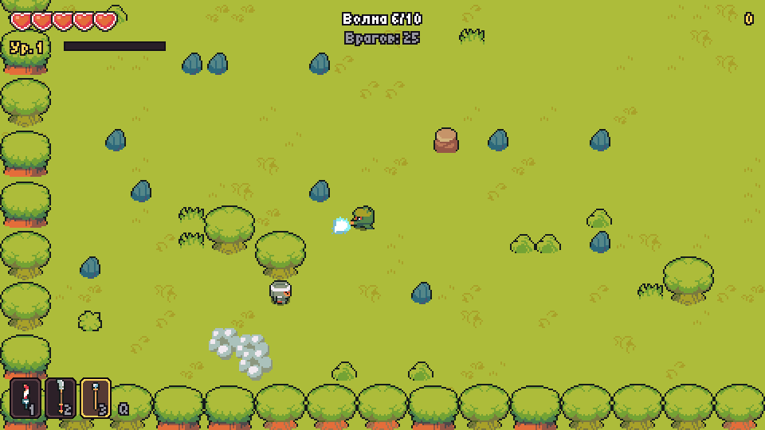
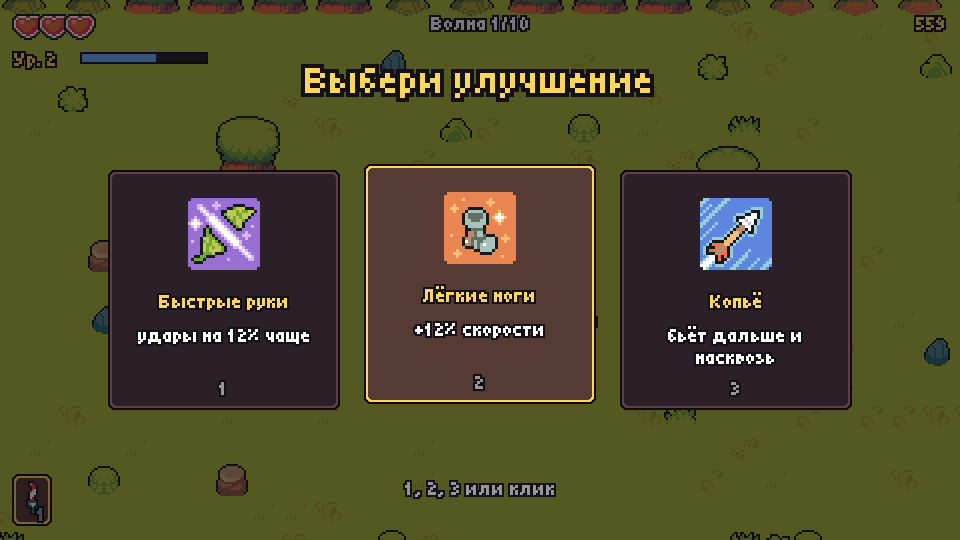
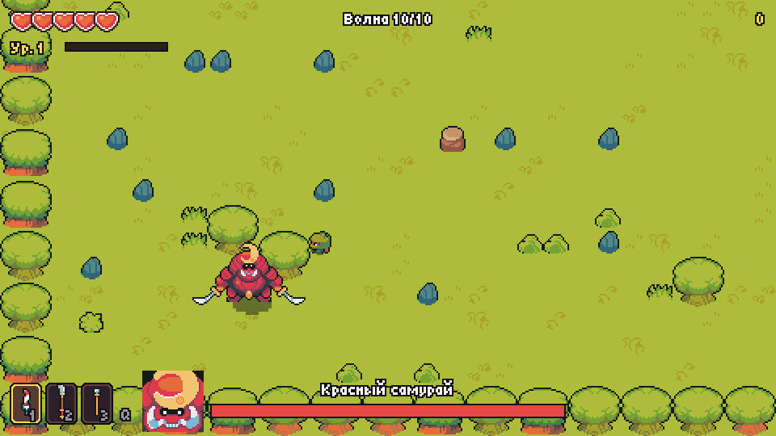

# Pixel Gamble

**Русский** · [English](README.en.md)

[](https://github.com/EDeev/pixel_gamble/actions/workflows/ci.yml)
[](https://github.com/EDeev/pixel_gamble/releases)

Пиксельный экшен на выживание на Python и pygame: десять волн врагов, улучшения между волнами и
финальный бой с Красным самураем. Партия занимает около 10 минут, рекорд сохраняется.

**[▶ Играть в браузере](https://edeev.github.io/pixel_gamble/)** · [Скачать для Windows и Linux](https://github.com/EDeev/pixel_gamble/releases/latest)

**Статус:** начат как учебный проект Яндекс Лицея (2022), в 2026 доработан до законченной игры;
версия с защиты — в релизе [v1.0.0](https://github.com/EDeev/pixel_gamble/releases/tag/v1.0.0)



**Стек:** Python 3.10+ · pygame · pygbag (браузерная сборка) · PyInstaller · pytest

## Как играть

| Действие | Клавиши |
|---|---|
| Движение | WASD или стрелки |
| Удар | левая кнопка мыши, пробел или J |
| Сменить оружие | Q, колесо мыши, 1–3 |
| Пауза | Esc или P |
| Полный экран | F11 |

При ударе мышью оружие бьёт в сторону курсора, с клавиатуры — туда, куда смотрит герой.

## Что в игре

- **10 волн.** Враги появляются у краёв арены, каждая следующая волна больше и сильнее, 10-я — босс.
- **5 видов врагов с разным поведением:**
  - слайм медленно ползёт к игроку;
  - летучая мышь петляет и пролетает над камнями;
  - ниндзя замахивается и делает выпад;
  - скелет держит дистанцию и метает сюрикены;
  - демон-циклоп предупреждает вспышкой и бросается тараном.
- **Босс — Красный самурай** с тремя фазами: рубит мечом вблизи, с 60% здоровья добавляет рывок с
  веером сюрикенов, с 30% ускоряется, призывает помощников и стреляет кольцом.
- **Три оружия:** меч бьёт широким взмахом, копьё — дальше и насквозь, посох стреляет зарядами.
- **11 улучшений:** между волнами нужно выбрать одно из трёх — сердца, урон, скорость, новое оружие,
  тройной заряд, лечение за победы и другие.
- **Опыт и уровни.** Сердечки выпадают из врагов и разбитых камней и лечат.
- **Меню, пауза, настройки** (громкость, язык, полный экран), итоги партии и рекорд.
- **Два языка:** русский и английский.

| Выбор улучшения | Босс |
|---|---|
|  |  |

## Быстрый старт

Проще всего — [играть в браузере](https://edeev.github.io/pixel_gamble/) или скачать готовый файл
со [страницы релизов](https://github.com/EDeev/pixel_gamble/releases/latest): `PixelGamble-windows.exe` или
`PixelGamble-linux.tar.gz`, Python для них не нужен.

Из исходников:

```bash
git clone https://github.com/EDeev/pixel_gamble.git
cd pixel_gamble
pip install -r requirements.txt
python game/main.py
```

Рекорд и настройки хранятся в `%APPDATA%\pixel_gamble` (Windows), `~/.local/share/pixel_gamble`
(Linux), в браузере — в `localStorage`.

## Устройство

```
game/
├── main.py              # точка входа (рабочий стол и браузер)
├── pixelgamble/
│   ├── app.py           # окно, главный цикл, меню, настройки, итоги
│   ├── game.py          # партия: волны, бой, камера, интерфейс боя
│   ├── player.py        # герой и оружие
│   ├── enemies.py       # пять видов врагов
│   ├── boss.py          # Красный самурай, три фазы
│   ├── waves.py         # состав волн и очередь появления
│   ├── upgrades.py      # улучшения между волнами
│   ├── world.py         # арена из плиток
│   ├── bot.py           # автоигрок для проверок и записи GIF
│   └── …                # ресурсы, эффекты, интерфейс, тексты, сохранения
└── assets/              # графика, звук, музыка и шрифты
tools/import_assets.py   # перенос нужных файлов из набора Ninja Adventure
web/template.tmpl        # шаблон страницы для pygbag
```

Мир рисуется в разрешении 480×270 и масштабируется в два раза, а интерфейс — поверх, в 960×540,
поэтому пиксели остаются чёткими и текст читается. Скорости не зависят от FPS. Игровой цикл
асинхронный, поэтому тот же код работает в браузере через [pygbag](https://github.com/pygame-web/pygbag).

## Проверки

```bash
pip install -r requirements-dev.txt
ruff check .
pytest
python game/main.py --bot --fast --frames 7200   # автоигрок, две минуты игры без окна
```

Тесты запускаются без окна и звука. Проверяются:
- автоигрок проходит первые волны;
- босс проходит все три фазы, победа и смерть ведут на экран итогов;
- улучшения применяются, а каждая волна выпускает ровно свой состав;
- сохранение переживает испорченный файл;
- персонаж не проходит сквозь стены.

CI прогоняет всё это на Python 3.10 и 3.12.

## Сборка

- **Релиз:** тег `v*` собирает `PixelGamble-windows.exe` и `PixelGamble-linux.tar.gz` через
  PyInstaller и прикладывает их к релизу.
- **Браузерная версия:** каждый пуш в `main` собирает её через pygbag и выкладывает на GitHub Pages.
  Локально это делается так:

  ```bash
  pip install pygbag==0.9.3
  python -m pygbag --build --width 960 --height 540 --template web/template.tmpl game
  ```

## Ресурсы

- Графика, звуки, музыка и шрифт заголовка — [Ninja Adventure](https://pixel-boy.itch.io/ninja-adventure-asset-pack)
  (pixel-boy, лицензия CC0), текст лицензии — `game/assets/LICENSE-ninja-adventure.txt`.
- Шрифт интерфейса — [Tiny5](https://github.com/Gissio/font_tiny5) (SIL Open Font License, `game/assets/fonts/OFL.txt`).
- Шаблон страницы — на основе стандартного шаблона pygbag.

## Лицензия

Учебный проект (Яндекс Лицей, 2021–2022 учебный год), доработанный в 2026 — код доступен для
изучения, отдельной лицензии нет.

## Автор

**Деев Егор Викторович** — [GitHub](https://github.com/EDeev) · [Telegram](https://t.me/DeevEgor) · [egor@deev.space](mailto:egor@deev.space)

---

<div align="center">
  <sub>⭐ Если проект оказался полезным, поставьте звёздочку на GitHub!</sub>
  <p><sub>Сделано с ❤️ — <a href="https://deev.space">deev.space</a></sub></p>
</div>
